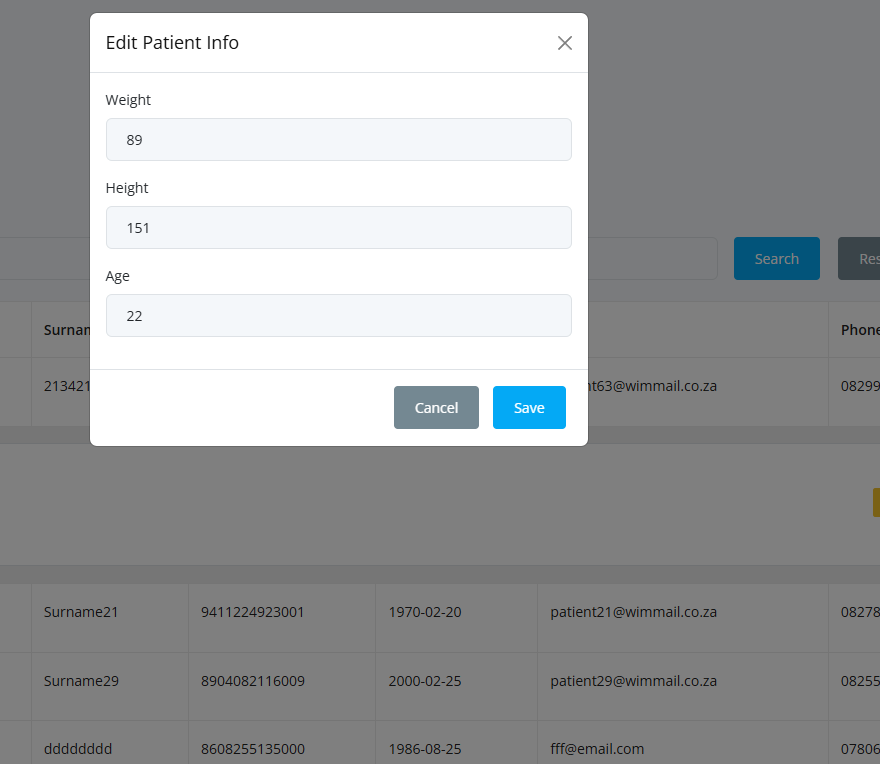
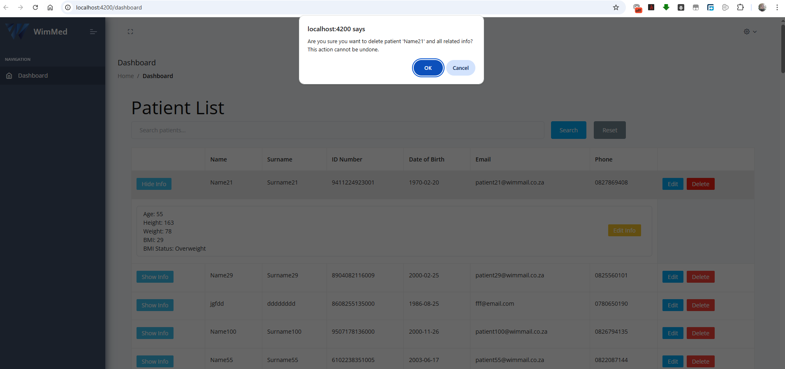
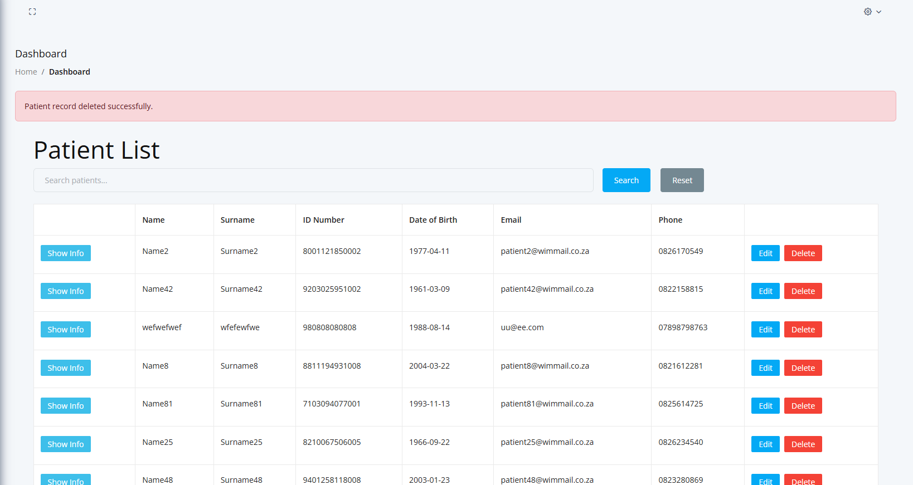

# WimMed Admin UI User Manual (with Screenshots)

## Table of Contents
1. Introduction
2. User Guide
   - Navigation
   - Patient List
   - Viewing and Editing Patient Info
   - Deleting Patients
   - Error Handling
3. Technical Specifications
   - API Endpoints and Usage
4. Offline Storage

---

## 1. Introduction
WimMed Admin UI is a web-based application for managing patient records, including searching, editing, and deleting patient and patient info. This manual provides a user-friendly guide and technical details for both end-users and technical staff.

---

## 2. User Guide

### Navigation
- The sidebar contains only the Dashboard for a focused experience.
- The top bar is minimal, with unnecessary items removed.

**Screenshot:**

### Patient List
- The main dashboard displays a searchable, sortable list of patients.
- Use the search bar to filter patients by name, ID, or other fields.

**Screenshot:**

### Viewing and Editing Patient Info
- Click "Show Info" to expand a patient's details (Age, Height, Weight, BMI, BMI Status).
- Click "Edit Info" to open a modal for editing Age, Height, and Weight only.
- After saving, the info block refreshes and a success message is shown.

**Screenshot:**

**Edit Modal:**

**Success Message:**

### Deleting Patients
- Click the red "Delete" button to remove a patient and all related info.
- A confirmation dialog will appear to prevent accidental deletion.
- After confirming, the patient is deleted via the API, the list refreshes, and a success message is shown.

**Delete Confirmation Dialog:**

**Patient Record Deleted Successfully:**

### Error Handling
- If an error occurs (e.g., invalid data, API failure), a clear error message is displayed in a red alert box.
- Error messages are beautified for readability.

---

## 3. Technical Specifications

### API Endpoints Used

#### 1. Get All Patients
- **Endpoint:** `GET /api/Patients/all`
- **Usage:** Fetches the full list of patients for display in the dashboard.

#### 2. Search Patients
- **Endpoint:** `GET /api/Patients/search?query={searchString}`
- **Usage:** Filters patients by search string.

#### 3. Get Patient Info by PatientId
- **Endpoint:** `GET /api/PatientInfos/GetPatientInfoByPatientId/{PatientId}`
- **Usage:** Fetches detailed info for a specific patient.

#### 4. Edit Patient
- **Endpoint:** `PUT /api/Patients/EditPatient/{PatientId}`
- **Usage:** Updates patient details (name, surname, ID, etc.).

#### 5. Edit Patient Info
- **Endpoint:** `PUT /api/PatientInfos/EditPatientInfo/{PatientInfoId}`
- **Usage:** Updates patient info (age, height, weight).

#### 6. Delete Patient (and Related Info)
- **Endpoint:** `DELETE /api/Patients/DeletePatient/{PatientId}`
- **Usage:** Deletes a patient and all related PatientInfos. Confirmation is required in the UI before this call is made.

### Error Handling
- All API errors are caught and displayed to the user in a user-friendly format.
- The UI displays the error message returned by the API, if available.

---

## 4. Offline Storage
- This manual can be downloaded and stored as a PDF or Markdown file for offline reference.
- All screenshots and scenario explanations are included for easy troubleshooting and onboarding.

---

*For further support, contact your WimMed system administrator.*
